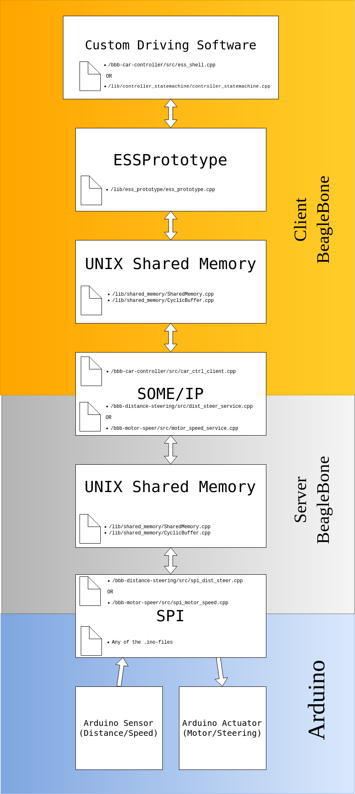

# Startup

To start the processes it is sufficient to build the executables using cmake and executing /bbb-car-controller/autostart.sh

It might however be interesting to have the programs run automatically at startup without user intervention. This can be done using crontab. Execute 
```
crontab -e
```
when logged in as debian user and paste 
```
@reboot /path/to/bbb-car-controller/autostart.sh
```
into the file replacing "/path/to/" accordingly.


# IP-Address

192.168.0.10


# Linux configurations

To run the entire system as smoothly as possible, it is recommended to use the following configuration files for this node.
Note that the bottom two files reside in "/cfg_bbb" (where / is the toplevel of this repo). In "/cfg_bbb", some
scripts can be found that help with the configurations. By running the script /deploy_code.sh, all files needed
for a smooth, scripted setup should be copied neatly onto the respective BegleBone nodes.

| File          | Place in Linux filesystem                                                                                |
|---------------|----------------------------------------------------------------------------------------------------------|
| hostname      | /etc/hostname                                                                                            |
| hosts         | /etc/hosts                                                                                               |
| interfaces    | /etc/network/interfaces                                                                                  |
| resolv.conf   | /etc/resolv.conf (run "sudo chattr +i /etc/resolv.conf" to prevent other programs from editing this file)|
| debian        | /etc/sudoers.d/debian                                                                                    |

# Building the car controller client

To build this program on the target node stand in the same folder as this README and type:
```bash
mkdir build
cd build
cmake ..
make
```

This will build all executables needed to control the system over vsomeip.

# Starting the car controller client
To start the program, stand in the build folder and type:
```bash
./car-ctrl-client & ./main
```
OR
```bash
./car-ctrl-client & ./ess_shell
```

This will run the controller statemachine or the ESS SHELL, respectively.
Additionally the following flags can be passed to "car-ctrl-client":

| Flag           | Argument        |Description
|----------------|-----------------|-----------------------------------------------------------------------------------------------
| --skip-go      | [EMPTY]         | Makes all threads unpausable, essentially means that availability of services will be ignored
| --motor-sleep  | A positive int  | Time spent sleeping (in millisec) between sending motor requests
| --steer-sleep  | A positive int  | Time spent sleeping (in millisec) between sending steering requests
| --setmin-sleep | A positive int  | Time spent sleeping (in millisec) between sending setmin requests

**Example**
To run the software with 300 milliseconds of sleep between setmin requests, and
make it ignore the availability of the services, stand in the build folder and type:
```bash
./car-ctrl-client --skip-go --setmin-sleep 300 & ./main
```

# Software Architecture Overview
**Architecture Overview**  


