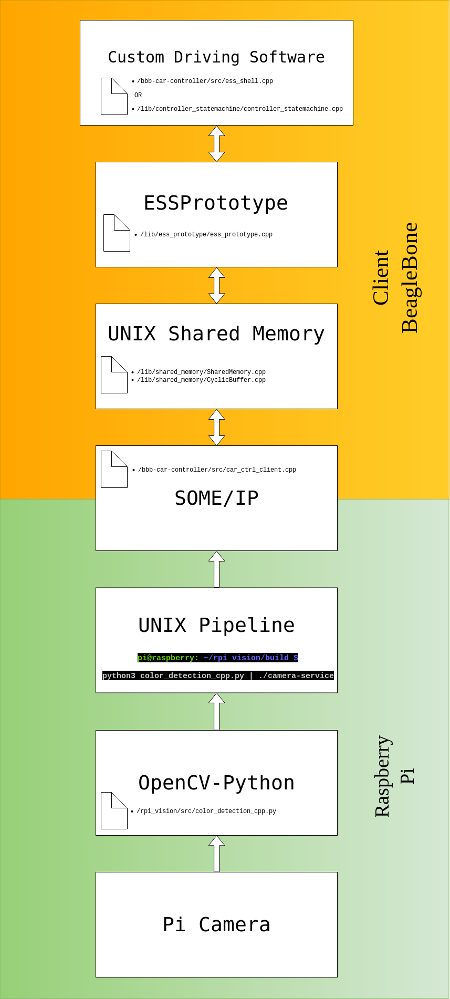

# IP-Address

192.168.0.4

# install_vsomeip.sh

This scripts updates the repo mirrors, installs the required dependencies and then installs
vsomeip under "/home/pi/someip/vsomeip". Vsomeip can then be used in C++ programs by
including <vsomeip/vsomeip.hpp>. Note that the Raspberry Pi requires Internet access for
this script to work.

# object_detection

The folder called "object_detection" contains the object detection code, which can run on laptop and Raspberry Pi. To run color
detection on Raspberry Pi, execute python3 color_detection_cpp.py

# Building the camera service

To build this program on the target node stand in the same folder as this README and type:
```bash
mkdir build
cd build
cmake ..
make
```

This will build all executables needed to publish sensor data and take actuator requests through vsomeip.

# Starting the camera service
To start the program, stand in the build folder and type:
```bash
python3 color_detection_cpp.py | ./camera-service
```

This will run the vsomeip service and the SPI master program, respectively.
Additionally the following flags can be passed to "motor-speed-service":

| Flag           | Argument        |Description
|----------------|-----------------|-----------------------------------------------------------------------------------------------
| --skip-go      | [EMPTY]         | Camera events will always be published, even if client has not given any GO-signal
| --sleep        | A positive int  | Time spent sleeping (in millisec) between publishing camera events

**Example**
To run the software with 100 milliseconds of sleep between camera events, and
make it ignore the availability of the go-signal, stand in the build folder and type:
```bash
python3 color_detection_cpp.py | ./camera-service --skip-go --sleep 100
```

# Software Architecture Overview
**Architecture Overview**  

